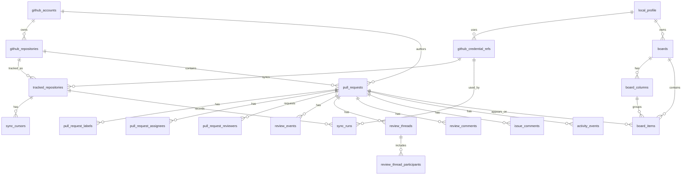

# Local Desktop Database Schema Proposal

This document refreshes the database direction for a local-only desktop V1. The
app should keep user data on the user's machine, use SQLite for durable app
state, and keep GitHub credentials out of the database.

The importable schema is in
[local-desktop-database-schema.sql](local-desktop-database-schema.sql). It is
SQLite-flavored DDL because the V1 runtime database should be an embedded local
database, and many free online database visualizers can import SQLite-style SQL.

## Product Requirements Covered

- The user's board is persisted locally in SQLite.
- Board labels/columns are local to this desktop profile.
- Fetched GitHub data is cached locally so the UI can read from SQLite.
- Board membership is stored separately from GitHub facts.
- GitHub credentials are stored in the OS keychain or GitHub CLI credential
  store, never in SQLite.
- The design keeps a later hybrid/server model possible without making V1 depend
  on a server.

## High-Level ER View

## Table Groups

### Local Profile And Credential References

`local_profile` stores the local viewer identity, such as the GitHub login used
to classify "needs my review" and "updated since I looked." This is not an
account table for a SaaS user. V1 can create one profile row, while the schema
keeps `profile_id` on local configuration tables so a later multi-profile
desktop mode does not require reshaping the GitHub cache.

`github_credential_refs` stores only metadata and pointers to where the token can
be found. For example:

- `auth_provider = 'os_keychain'` with `keychain_service` and
  `keychain_account`.
- `auth_provider = 'github_cli'` with `gh_host`, relying on `gh auth token` or a
  GitHub CLI library/harness.

The table deliberately has no encrypted token column. A desktop app can use
macOS Keychain, Windows Credential Manager, or Linux Secret Service through a
cross-platform keychain library. If the user chooses the GitHub CLI path, the
GitHub CLI owns credential storage.

### Local GitHub Cache

`github_accounts`, `github_repositories`, `pull_requests`, review tables,
comment tables, and `activity_events` model GitHub facts. These rows are cached
locally and are not owned by a board. A PR should be stored once in the local
cache even if it appears in multiple boards later.

The schema keeps `raw_payload_json` fields so ingestion can be deterministic and
we can re-project details without immediately re-fetching every GitHub object.

### Repository Tracking And Sync

`tracked_repositories` is local profile configuration for which repositories the
desktop app syncs. It points at a credential reference when private or
authenticated access is needed.

`sync_cursors` stores ETags, pagination cursors, since timestamps, or other
per-repository sync state. This is where we avoid wasteful polling and support
incremental refresh.

`sync_runs` records sync attempts for troubleshooting. This matters more in a
desktop app because users need clear local diagnostics when a token expires, a
rate limit is hit, or the laptop resumes after sleep.

### Local Board Data

`boards` is the local profile's board container. V1 can start with one default
board.

`board_columns` stores the user's editable labels/columns. This replaces the
current browser `localStorage` label storage and includes `width_px` for the
resizable Kanban layout.

`board_items` determines which cached PRs appear on the board. It links a board
to a PR and stores local workflow state such as column placement, sort order,
pinned/muted state, and last-seen timestamps.

This is the important boundary:

- GitHub cache tables answer "what exists on GitHub?"
- Board tables answer "how does this local user organize and process it?"

## Credential Storage Decision

For local-only V1, use OS-backed credential storage rather than database
encryption:

1. Store GitHub tokens in the OS credential store:
   - macOS Keychain
   - Windows Credential Manager
   - Linux Secret Service/libsecret
2. Store only a lookup reference in SQLite.
3. Support GitHub CLI auth as a developer-friendly path when available.
4. Never write tokens to SQLite, logs, crash reports, screenshots, or exported
   debug bundles.
5. When calling GitHub, read the token into memory, use it for the request, and
   discard it as soon as practical.

This is simpler and more defensible than server-side PAT storage for a personal
desktop app. It also makes the security story easy to explain: the app owns the
board database, but the operating system owns the secret.

## Desktop Problems And V1 Mitigations

### No Reliable Webhooks

V1 should poll GitHub. Use `sync_cursors` for ETags and incremental refresh, and
make the refresh interval visible/configurable later. Webhook freshness can be
revisited in a hybrid model.

### Per-User Rate Limits

Every desktop user syncs independently. V1 should keep the sync scope narrow:
only selected repositories, open PRs first, and incremental updates. A later
server can cache public repository facts if this becomes painful.

### Weak Background Sync

V1 should sync while the app is open. A background helper can come later, but it
should not be required for the first local version.

### Multi-Device State

V1 is local-only. Boards do not sync across devices. The first escape hatch
should be export/import or user-controlled backup of the SQLite database.

### Sharing And Team Workflows

V1 is a personal cockpit. Shared boards, team labels, and organization dashboards
belong in a later server-backed mode.

## Hybrid Path Later

The schema keeps the future hybrid model clear:

- Desktop keeps private credentials and private board state local.
- A server can later cache public repository facts.
- A server can later store encrypted backup blobs, not plaintext board rows.
- Shared/team boards can become a separate server-backed feature instead of
  changing the local-only V1 storage contract.

## Migration Shape From The Current App

1. Create a desktop storage package backed by SQLite.
2. Add OS keychain or GitHub CLI credential access.
3. Move current browser `localStorage` keys for labels, card bucket, item order,
   last-seen state, pinned/muted state, and column width into `boards`,
   `board_columns`, and `board_items`.
4. Move GitHub fetch results from API/sample state into local GitHub cache
   tables.
5. Make the UI read from a local repository interface so a future hybrid/server
   source can be added behind the same boundary.

## Implementation Notes

- The SQL file is a proposal, not a migration yet.
- IDs are `text` so the app can use UUIDs, GitHub node IDs, or stable generated
  IDs where appropriate.
- Booleans are stored as `integer` with `0`/`1` checks for SQLite compatibility.
- JSON fields are stored as `text` so the schema works in SQLite builds without
  depending on JSON extensions.
- `archived_at` is used for board objects so destructive UI actions can be
  reversible before hard deletion policies are added.
