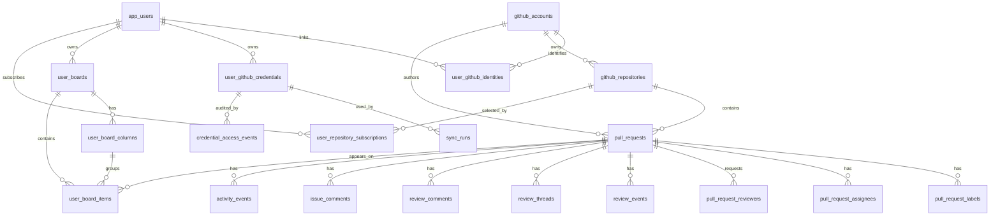

# SaaS Database Schema Proposal

This document describes the proposed database shape for moving PR Tracker from a
single-user local workflow into a SaaS product where each user has a persisted
board.

The importable schema is in [saas-database-schema.sql](saas-database-schema.sql).
It is PostgreSQL-flavored DDL because most free online database visualizers can
import SQL DDL directly, and PostgreSQL matches the app's current MikroORM
database package.

## Product Requirements Covered

- Each app user has their own persisted board.
- Board labels are scoped to the user through the user's board columns.
- GitHub facts are stored once in common tables, without a user ownership link.
- Board membership is stored separately and links a user's board to shared PRs.
- GitHub credentials are linked to a user, but encrypted so plaintext tokens are
  never stored in the database.

## High-Level ER View

## Table Groups

### Users And Credentials

`app_users` is the SaaS identity root. The schema keeps this separate from
GitHub accounts because a SaaS user is an app principal, not a GitHub fact.

`user_github_identities` links an app user to the common `github_accounts` row
that represents their GitHub identity. The GitHub account itself remains common
data because it may appear as a PR author, reviewer, commenter, or organization
owner in many users' boards.

`user_github_credentials` stores encrypted PAT material for the user. It is
separate from the identity link because a user may rotate credentials, revoke a
credential, or eventually migrate from PATs to a GitHub App without changing the
identity mapping.

### Common GitHub Data

`github_accounts`, `github_repositories`, `pull_requests`, review tables,
comment tables, labels, assignees, reviewers, activity events, webhook
deliveries, and sync runs model GitHub facts. These tables intentionally do not
store `user_id` on the PR rows. A PR is the same GitHub object regardless of how
many users have it on their board.

This keeps ingestion idempotent and avoids duplicating GitHub data per user.
User-specific interpretation belongs in board tables.

### User Board Data

`user_boards` is the user's board container. The schema allows multiple boards,
but the `user_boards_one_default_idx` unique index enforces at most one active
default board per user. The product can start with one default board and still
have a clear path to multiple boards later.

`user_board_columns` stores the user-scoped labels/columns. These replace the
current browser `localStorage` labels. Column width is persisted here too, so the
resizable Kanban layout survives across sessions and devices.

`user_board_items` is the user-linked entry that determines whether a shared PR
appears on a user's board. It stores `user_id` directly, links that user-owned
board to common `pull_requests`, and stores user-specific state such as column
placement, sort order, pinned/muted, and last-seen timestamps. The composite
foreign key from `(board_id, user_id)` to `user_boards` prevents an item from
being attached to another user's board.

This table is the key boundary: GitHub data is common, but board membership and
local workflow state are per user.

### Repository Selection

`user_repository_subscriptions` records which shared repositories a user wants
the app to track. This is user-specific configuration, not GitHub fact data. The
repository row remains common.

## Personal Access Token Storage Decision

GitHub's current guidance is that PATs should be treated like passwords, that
fine-grained PATs are preferred over classic PATs when possible, and that
long-lived integrations should generally use a GitHub App instead of a PAT:

- GitHub PAT guidance: https://docs.github.com/en/authentication/keeping-your-account-and-data-secure/managing-your-personal-access-tokens
- GitHub App guidance: https://docs.github.com/en/enterprise-cloud@latest/apps/creating-github-apps/about-creating-github-apps/deciding-when-to-build-a-github-app
- GitHub App installation token behavior: https://docs.github.com/en/apps/creating-github-apps/authenticating-with-a-github-app/authenticating-as-a-github-app-installation

For the SaaS product, the preferred long-term integration should be a GitHub App:
installation tokens are short-lived, repository-scoped, permission-scoped, and
do not depend on an individual user's long-lived PAT remaining valid.

If the product accepts user PATs during the transition, the database should store
only encrypted token material:

1. Prefer fine-grained PATs with the smallest repository selection and
   permissions needed for read-only review inbox ingestion.
2. Require or strongly encourage expiration dates.
3. Generate a random data-encryption key per credential.
4. Encrypt the PAT with authenticated encryption, represented in the schema as
   `AES-256-GCM-envelope`.
5. Encrypt the data-encryption key with a key-encryption key held in a KMS, HSM,
   or managed secrets service outside the database.
6. Store only ciphertext, encrypted data key, algorithm, key id, metadata,
   expiry, and revocation status in `user_github_credentials`.
7. Store an HMAC fingerprint for duplicate detection and audit correlation, but
   never a raw token hash with an app-wide unsalted digest that could become a
   token lookup oracle.
8. Decrypt only inside the backend worker/API process immediately before a
   GitHub API call, keep plaintext in memory for the shortest practical time,
   and never log it.
9. Record credential use in `credential_access_events` without storing request
   headers, token values, or GitHub response bodies that may echo sensitive
   data.

This follows OWASP's direction to minimize sensitive storage, use authenticated
encryption for confidential data at rest, and keep encryption keys out of
plaintext application/database storage:

- OWASP Cryptographic Storage Cheat Sheet: https://cheatsheetseries.owasp.org/cheatsheets/Cryptographic_Storage_Cheat_Sheet.html
- OWASP Secrets Management Cheat Sheet: https://cheatsheetseries.owasp.org/cheatsheets/Secrets_Management_Cheat_Sheet.html
- OWASP Key Management Cheat Sheet: https://cheatsheetseries.owasp.org/cheatsheets/Key_Management_Cheat_Sheet.html

## Why Not Hash PATs?

Password-style hashing is wrong for GitHub PATs because the app must recover the
token to call GitHub. Hashing would only support verification, not API use.
Reversible encryption is required, so the key-management boundary matters more
than the database column type.

## Why Not Rely Only On Database Encryption?

Database, disk, or volume encryption is useful but not sufficient for this
threat model. If the application or a database dump is compromised, database
level encryption may already be transparently decrypted. Application-level
envelope encryption keeps the PAT encrypted in normal query results and backups,
and it makes the KMS/HSM permission boundary part of the protection model.

## Migration Shape From The Current App

1. Keep common GitHub ingestion tables shared.
2. Add `app_users`, `user_boards`, `user_board_columns`, and
   `user_board_items`.
3. Migrate current default labels into `user_board_columns` for the first user.
4. Migrate current local queue state into `user_board_items`.
5. Replace browser `localStorage` writes for labels, item order, card bucket,
   last-seen state, pinned/muted state, and column width with API calls backed by
   the new user board tables.
6. Move GitHub credential setup from local settings into
   `user_github_credentials`, using envelope encryption before the first write.

## Implementation Notes

- The SQL file is a proposal, not a MikroORM migration yet.
- The schema keeps raw GitHub payloads for deterministic reprocessing while
  still promoting the fields needed by the reviewer workflow.
- `on delete cascade` is used for user-owned board/configuration data.
- `on delete restrict` is used where deleting shared GitHub facts would make
  historical activity misleading.
- `user_board_items.user_id` is intentionally redundant with `user_boards.user_id`
  so board membership can be filtered and protected directly by user in API
  queries and future row-level security policies.
- `archived_at` is used for user board objects so destructive UI actions can be
  reversible before hard deletion policies are added.
